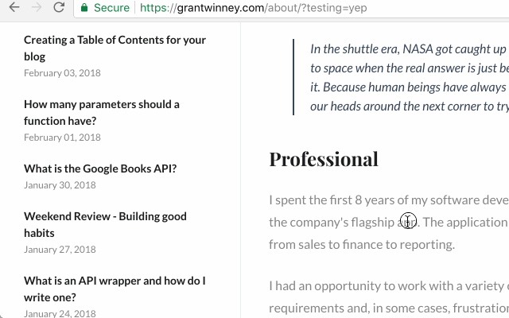

# Generate Links for Headers

I frequently want to share a link with someone, but I want to link to a specific section of the page. That means checking out the source code for the page, finding the header element or an anchor nearby, and (if it has an ID or Name assigned to it) appending it to the URL before sharing it.

I figured I can do better than that.

## Create links for all headers automatically

Available for [Chrome](https://chrome.google.com/webstore/detail/generate-links-for-header/dckfkngmahjdokkkmconmfjdmicjcmgf) and [Firefox](https://addons.mozilla.org/en-US/firefox/addon/generate-links-for-headers), it scans the page and generates anchors for all headers on the page, *assuming they have an ID or Name assigned.*

* Hover over the header, and the anchor link will appear.
* Click on the "chain" icon to copy the link to the clipboard.

### Headers with child elements

If the header itself doesn't have an ID or Name, it traverses all elements inside the header tags looking for the first element with an ID or Name assigned, since [any element can be used as an anchor](https://www.w3.org/TR/html4/struct/links.html#h-12.2.3). If it finds one, it uses it as the anchor; if not, then there's nothing to link to and you won't see the icon appear for that header.

### Excluded sites

The following sites are intentionally excluded, either due to implementing similar behavior already, or because displaying the icon doesn't work due to existing site layout/styles.

* w3.org/TR
* startpage.com
* github.com

## Questions? Issues?

If you have any questions, comments, or issues, feel free to [create an issue](https://github.com/grantwinney/generate-links-for-headers/issues/new) and I'll check it out as my schedule permits.

Enjoy!

---

## History

**FEB 2018**
- 1.0 - Initial
- 1.0.2 - Show border momentarily when clicking on icon, to indicate something has happened.
- 1.0.4 - Float icon to left of header instead of making it an inline block element. Previously, when the header was very long it consumed the -20px margin I had left for the icon, and the icon moved above the header. This fixes both issues.

**MAR 2018**

- 1.0.5 - Exclude portion of W3C site that breaks, and doesn't really need this extension anyway (they provide similar behavior).
- 1.0.6 - Some sites, like Wikipedia, nest elements with IDs _inside_ header elements. If a header element doesn't have an ID, try to grab the first element with ID inside it (if any) and use that. Also, exclude Startpage.com which uses a header for every block of results.
- 1.0.7 - Exclude github.com - it implements similar behavior.
- 1.0.8 - Check for 'name' attribute in addition to 'id'.
- 1.0.9 - Eliminate choppiness when hovering back and forth between header title and link.
- 1.1.0 - Specify max z-index to ensure link shows above any other element. The link is tiny and invisible most of the time, and it needs to appear above all other elements when it's visible to be of any use at all.
- 1.1.1 - Modified the link in the manifest file.
- 1.2.1 - Adjusted CSS due to a bug that caused the link element to be hidden.
- 1.2.2 - Allow links to be generated on help.github.com; was previously disabled for all github.com subdomains.
